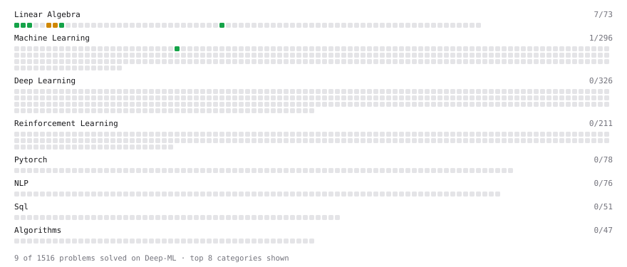

# Deep-ML

My machine learning practice from [Deep-ML](https://www.deep-ml.com). Every solution here was written by hand.

**10** solved · 10 problems · 0 labs · 0 math

[**Browse the interactive portfolio**](https://Jupiterian.github.io/deep-ml/) to replay this filling in over time.

## Problems

| | Difficulty | Solved | |
| --- | --- | --- | --- |
| [Calculate 2x2 Matrix Inverse](https://www.deep-ml.com/problems/8) | easy | 2026-10-08 | [solution](problems/0008-calculate-2x2-matrix-inverse) |
| [Calculate Root Mean Square Error (RMSE)](https://www.deep-ml.com/problems/71) | easy | 2026-10-02 | [solution](problems/0071-calculate-root-mean-square-error-rmse) |
| [Derivative of a Polynomial](https://www.deep-ml.com/problems/116) | easy | 2026-10-02 | [solution](problems/0116-derivative-of-a-polynomial) |
| [Linear Regression Using Normal Equation](https://www.deep-ml.com/problems/14) | easy | 2026-10-09 | [solution](problems/0014-linear-regression-using-normal-equation) |
| [Matrix-Vector Dot Product](https://www.deep-ml.com/problems/1) | easy | 2026-10-01 | [solution](problems/0001-matrix-vector-dot-product) |
| [Reshape Matrix](https://www.deep-ml.com/problems/3) | easy | 2026-10-03 | [solution](problems/0003-reshape-matrix) |
| [Transpose of a Matrix](https://www.deep-ml.com/problems/2) | easy | 2026-10-02 | [solution](problems/0002-transpose-of-a-matrix) |
| [Vector Element-wise Sum](https://www.deep-ml.com/problems/121) | easy | 2026-09-30 | [solution](problems/0121-vector-element-wise-sum) |
| [Calculate Eigenvalues of a Matrix](https://www.deep-ml.com/problems/6) | medium | 2026-10-01 | [solution](problems/0006-calculate-eigenvalues-of-a-matrix) |
| [Matrix Transformation ](https://www.deep-ml.com/problems/7) | medium | 2026-10-08 | [solution](problems/0007-matrix-transformation) |

---

_This file is regenerated by Deep-ML on every push._
